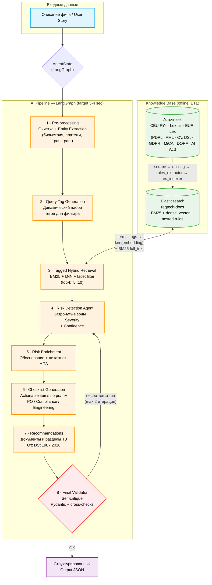

# Архитектура системы — Финтех-регуляторный радар

> **Track 4 (хакатон, 48 ч).** Ассистент для продуктовых и инженерных
> команд финтеха: принимает описание фичи (user story или свободный
> текст), за 3–4 секунды детектит регуляторные риски (AML, KYC, PSD2/3,
> GDPR, MiCA, DORA, AI Act, PDPL РУз, O'z DSt 1987:2018) и
> формирует пошаговый чеклист с прямыми ссылками на статьи НПА.

Этот документ описывает **всю систему целиком**: слой данных (ETL),
поиск (Elasticsearch), AI-агент (LangGraph) и интеграцию через Backend /
Frontend. Принятые архитектурные решения и tradeoffs зафиксированы в
конце документа.

Существующие смежные доки:
- [`docs/AGENTS.md`](AGENTS.md) — общая структура репозитория и
  соглашения по микросервисам.
- [`docs/agent-tools.md`](agent-tools.md) — готовые `@tool`-функции для
  ai-core (подключение к ES, hybrid поиск, get_document, verify_quote).
- [`workers/README.md`](../workers/README.md) — инструкции по запуску
  ETL.
- [`workers/docs/architecture.md`](../workers/docs/architecture.md) —
  детальный deep-dive по pipeline воркеров.

---

## 1. Цель системы

**Проблема:** продуктовые и инженерные команды узнают, что фича попадает
под AML/KYC/PSD/PDPL/AI Act/etc., **уже после релиза** — на код-ревью,
аудите или (хуже) от регулятора. Стоимость переделки растёт по часам.

**Решение:** RAG-ассистент над верифицированным корпусом нормативно-правовых
актов (НПА). Вход — описание фичи на естественном языке.
Выход — структурированный JSON: затронутые регуляторные зоны, чеклист
действий (по ролям), список документов к обновлению, цитаты из законов.

**Ключевые критерии оценки (из ТЗ):**
1. Точность алгоритма — детектит **неочевидные** риски (например,
   "добавить кнопку шаринга контактов" → data privacy / PDPL).
2. Применимость — чеклист реально полезен для PO без юридической
   подготовки.
3. UX — нетехнический специалист с первого раза понимает результат.
4. Опционально: цитаты-пруфы + интеграция с трекером задач.

---

## 2. Высокоуровневая архитектура

```
                                                                             ┌──────────┐
                              ┌──── Внешние источники ────┐                  │   PO /   │
                              │                           │                  │Compliance│
                              ▼                           ▼                  │ Engineer │
                       cbu.uz/ru/documents       eur-lex.europa.eu           └────┬─────┘
                       lex.uz/ru (okoz=6536)                                      │
                              │                           │                       │ user
                              │                           │                       │ story
                              ▼                           ▼                       ▼
   ┌───────────────────────────────────────────────────────────┐         ┌──────────────┐
   │                       WORKERS (ETL)                       │         │  FRONTEND    │
   │  cbu_worker · lex_worker · eurlex_worker                  │         │  React, :3000│
   │       └─► md_converter (docling) ──► rules_extractor      │         └──────┬───────┘
   │                  ▲                         │              │                │ HTTP+SSE
   │                  │                         │              │                ▼
   │       MinIO   regtech-docs/      Postgres  │              │         ┌──────────────┐
   │       MinIO   regtech-md/        public.documents         │         │   BACKEND    │
   │                                  public.documents_md      │         │  FastAPI :8000│
   │                                  public.rules             │         │  • Jira API  │
   │                                  public.rule_extractions  │         │  • SQLite log│
   │                                                           │         └──────┬───────┘
   │           ▼                                               │                │ HTTP+SSE
   │   ┌───────────────┐                                       │                ▼
   │   │  es_indexer   │ ─── reg.indexed (Kafka) ──────────►   │         ┌──────────────────┐
   │   │  (embeddings  │                                       │         │   AI-CORE        │
   │   │   OpenRouter) │                                       │         │ FastAPI :8001     │
   │   └───────┬───────┘                                       │         │ LangGraph         │
   │           ▼                                               │         │ + Anthropic Claude│
   │     Elasticsearch                                         │   ◄────►│ + ES retriever    │
   │     regtech-docs (BM25 + dense kNN + nested rules)        │  hybrid │ + Pydantic v2     │
   │                                                           │ retrieval│ output JSON       │
   └───────────────────────────────────────────────────────────┘         └──────────────────┘
```

Поток обработки одного запроса от пользователя — слева направо нижней
половиной диаграммы; **корпус НПА** заранее проиндексирован верхней
половиной (offline pipeline, идёт постоянно по расписанию).

---

## 3. Технологический стек

| Слой              | Технология                                                       | Где живёт                |
|-------------------|------------------------------------------------------------------|--------------------------|
| Frontend          | React + Node.js                                                  | `/frontend`              |
| Backend           | Python 3.11+ · FastAPI · SQLite · Jira REST v3                   | `/backend`               |
| AI-core           | Python 3.11+ · FastAPI · **LangGraph** · Anthropic SDK · Pydantic v2 | `/ai-core`               |
| ETL workers       | Python 3.12 · Playwright · docling · kafka-python · OpenRouter   | `/workers`               |
| Vector + lexical search | **Elasticsearch 8.15** (dense_vector + BM25 + nested)      | container `regtech_elasticsearch` |
| Streaming bus     | Apache Kafka (KRaft)                                             | container `kafka`        |
| Object store      | MinIO (S3-совместимый)                                           | container `regtech_minio` |
| Metadata store    | PostgreSQL 16                                                    | container `regtech_postgres` |
| LLM (extraction)  | OpenRouter → `google/gemini-3-flash-preview`                     | вызывается из workers    |
| LLM (agent)       | Anthropic Claude 3.5 Sonnet (primary) · GPT-4o / Grok (fallback) | вызывается из ai-core    |
| Embeddings        | OpenRouter → `openai/text-embedding-3-small` (1536d)             | используется и в ETL и в агенте |

> **Решение по vector DB:** в `AGENTS.md` упомянут Qdrant, в первоначальном
> наброске архитектуры — ChromaDB или Qdrant. Финальный выбор —
> **Elasticsearch**: у нас уже всё проиндексировано (3 877 документов),
> `dense_vector` в ES 8.x поддерживает hybrid kNN + BM25 в одном запросе,
> а агент получает BM25-хайлайтинг для цитат-пруфов бесплатно. Подробнее
> — в разделе «Принятые решения».

---

# ЧАСТЬ I. ETL Pipeline — слой данных

## 4. Источники

| источник | базовый URL                                       | покрытие                              | объём |
|----------|---------------------------------------------------|---------------------------------------|------:|
| `cbu`    | `https://cbu.uz/ru/documents/`                    | 8 категорий ЦБ РУз (3311–3317, 3344)   | 676   |
| `lex`    | `https://lex.uz/ru/search/ext?lang=1&okoz=6536`   | классификатор "Финансы и кредит" РУз  | 2 440 |
| `eurlex` | `https://eur-lex.europa.eu/`                      | 29 fintech-запросов (GDPR, PSD3, MiCA, DORA, AI Act, eIDAS2, AML6, …) | 761 |

**PDPL** и национальные требования к ИС попадают через CBU и Lex.uz;
EUR-Lex даёт нам GDPR/PSD2/PSD3/MiCA/DORA/AI Act как первоисточник.

> **Lex.uz** скачивается и конвертируется в Markdown, но **не**
> отправляется в `rules_extractor` (фильтр `RULES_SOURCES=cbu,eurlex`):
> MD-вывод Lex.uz содержит chrome сайта и часть страниц — заглушки
> "только на узбекском". Документы из Lex.uz остаются в ES с
> `has_rules: false` и доступны полнотекстовому BM25.

## 5. Хранилище

```
MinIO  regtech-docs/raw-docs/<source>/<doc_id>/<doc_id>.<ext>   ← сырые байты
MinIO  regtech-md/<source>/<doc_id>/<doc_id>.md                  ← docling Markdown

PostgreSQL
  public.documents          (doc_id PK, hash_id UNIQUE, source_id, name,
                             source_url, s3_key, category, language,
                             processing_status, first_seen_at, …)
  public.documents_md       (doc_id PK→documents, md_s3_key, md_hash, status)
  public.rules              (rule_id, doc_id PK→documents, tag, title,
                             requirement, verification_method,
                             positive_examples JSONB, negative_examples JSONB,
                             severity, source JSONB)
  public.rule_extractions   (doc_id PK→documents, status, rules_count,
                             strategy, llm_calls, processing_time_s, …)

  cbu.normative_acts        (CBU-specific метаданные)
  lex.acts                  (Lex.uz-specific метаданные)
  eurlex.regulations        (EUR-Lex-specific метаданные)
```

**Дедупликация — по SHA-256 контента,** не по URL и не по `doc_id`. Это
делает все стадии **at-least-once safe**: можно перезапускать
консьюмеров, повторять Kafka-сообщения, дёргать `--backfill` — ничто не
дублируется.

## 6. Стадии pipeline

Все стадии общаются через Kafka. Каждая стадия — отдельный контейнер.

| topic            | producer            | consumer          | событие                  |
|------------------|---------------------|-------------------|--------------------------|
| `reg.cbu`        | cbu_worker          | md_converter      | `document.new`/`.updated` |
| `reg.lex`        | lex_worker          | md_converter      | то же                    |
| `reg.eurlex`     | eurlex_worker       | md_converter      | то же                    |
| `reg.md`         | md_converter        | rules_extractor, es_indexer | `document.md.ready` |
| `reg.rules`      | rules_extractor     | es_indexer        | `document.rules.ready`   |
| **`reg.indexed`**| **es_indexer**      | (UI/notifier)     | `document.indexed`       |

### 6.1. Скрейперы (`cbu_worker`, `lex_worker`, `eurlex_worker`)

Общий `BaseWorker`: одна сессия Playwright на `run_once()`, warm-up для
обхода Akamai/Imperva WAF, content-hash dedup, hash-safe upsert в
`public.documents`. Особенности:
- **CBU**: проход по 8 Bitrix-категориям → переход на `lex.uz/docs/<id>`
  → рендер закона.
- **Lex.uz**: ASP.NET `__doPostBack` пагинация, `_safe_page_content()`
  retry-loop для двойной навигации.
- **EUR-Lex**: 29 fintech-запросов, `wait_until="domcontentloaded"`
  (а не `networkidle` — WAF висит на analytics-beacons), фильтр
  `MIN_DOC_BYTES=30_000` против challenge-стабов.

### 6.2. `md_converter`

Kafka consumer на `reg.cbu`/`reg.lex`/`reg.eurlex`. Достаёт сырьё из
MinIO, прогоняет через `docling.DocumentConverter`, кладёт `.md` в
бакет `regtech-md`, пишет в `public.documents_md`. Идемпотентен:
пропускает re-конвертацию если `raw_hash` совпадает с уже обработанным.

### 6.3. `rules_extractor` (LLM)

Kafka consumer на `reg.md`. Скачивает MD, запускает
`rules_generator.RuleGenerator`:
- **Direct strategy** (≤ 50K токенов): один LLM-вызов с полным
  документом.
- **Map-Reduce strategy** (> 50K): чанк → "извлеки правила из этого
  фрагмента" × N → "сведи и дедуплицируй" × 1.

Параллелит `RULES_PARALLELISM=3` потоков; каждому потоку — своё
psycopg2 connection и свой `AsyncOpenAI` (потому что httpx event loop
привязан к одному потоку). Кладёт правила в `public.rules`, статус — в
`public.rule_extractions`.

Каждое правило — это:
```json
{
  "rule_id":             "R-PDP-001",
  "tag":                 "personal_data",
  "title":               "Lawful basis required",
  "requirement":         "Контроллер не вправе обрабатывать персональные данные без одного из шести оснований ст. 6.",
  "verification_method": "Закрепить выбранное основание в ROPA.",
  "positive_examples":   ["явное согласие при регистрации"],
  "negative_examples":   ["скрапинг публичных данных без согласия"],
  "severity":            "critical"
}
```

Таксономия тегов — `rules_common/tags_loader.py`. **Multi-label tagging
на уровне правил уже выполнено на этапе ETL** — это и есть тот самый
"hierarchical decomposition + tagging", о котором писал AI-агент-документ:
мы делаем это offline, один раз, а не на каждый user-query.

### 6.4. `es_indexer`

Kafka consumer на `reg.md` + `reg.rules`. Альтернативно — режим
`--backfill` (один проход по PG, индексируем всё что есть).

Шаги на каждый документ:
1. Достаёт строку из `documents ⋈ documents_md ⋈ rules` (LEFT JOIN —
   правила могут отсутствовать).
2. Скачивает MD из `regtech-md` бакета.
3. Строит `summary` (для embedding): `title + " ⏐ ".join([tag] title — requirement, …)` либо первые ~8KB MD если правил нет.
4. Считает embedding через OpenRouter → `openai/text-embedding-3-small` (1536d).
5. Bulk-индекс в ES (`_id = doc_id`, upsert).
6. Публикует `document.indexed` в `reg.indexed`.

**Объём на текущий момент:** 3 877 проиндексированных документов
(2 440 lex · 761 eurlex · 676 cbu), 819 из них с экстрактеными правилами.

## 7. Elasticsearch index — `regtech-docs`

Один документ ES = один регуляторный документ. Правила — `nested`
массив. Embedding **doc-level**, не chunk-level.

```jsonc
{
  "settings": {
    "number_of_shards": 1,         // hackathon scale
    "number_of_replicas": 0,
    "refresh_interval": "5s"
  },
  "mappings": {
    "properties": {
      "doc_id":        "keyword",
      "source":        "keyword",    // cbu | lex | eurlex
      "category":      "keyword",    // aml_cft, payments, data_protection, …
      "language":      "keyword",
      "title":         "text",
      "source_url":    "keyword",
      "discovered_at": "date",
      "full_text":     "text",       // полный MD, обрезан до 200 KB — для BM25 и highlighting
      "summary":       "text",       // что эмбеддим: title + concat правил
      "embedding":     "dense_vector(1536, cosine, indexed=true)",
      "has_rules":     "boolean",
      "rules_count":   "integer",
      "tags":          "keyword[]",  // плоские для facet-aggs
      "severities":    "keyword[]",
      "rules": {
        "type": "nested",
        "properties": {
          "rule_id":             "keyword",
          "tag":                 "keyword",
          "title":               "text",
          "requirement":         "text",
          "verification_method": "text",
          "severity":            "keyword",
          "positive_examples":   "text",
          "negative_examples":   "text"
        }
      }
    }
  }
}
```

**Tag Propagation** (из изначальной AI-доки): теги дочерних правил уже
агрегированы в плоский массив `tags` на уровне родительского документа.
То есть запросом `terms: {tags: "personal_data"}` достаём все
документы где **хотя бы одно** правило помечено этим тегом — без
nested-агрегаций.

---

# ЧАСТЬ II. AI Agent — `ai-core`

## 8. Назначение

Принимает описание фичи, возвращает строго-типизированный JSON со
списком регуляторных рисков, чеклистом и рекомендациями. Запрос
обслуживается **синхронно** с целевым SLA **3–4 секунды**.

Анти-цели:
- **Никаких галлюцинаций НПА.** Любой риск должен приходить с цитатой
  из существующего документа из ES.
- **Никакого свободного текста наружу.** Только Structured Output.
- **Никаких "общих советов".** Чеклист только в формате actionable
  items со ссылкой на конкретное правило/статью.

## 9. Технологический стек агента

| компонент            | технология                                              | зачем |
|----------------------|---------------------------------------------------------|-------|
| Оркестрация          | **LangGraph**                                           | граф с циклической валидацией (self-critique) |
| LLM (primary)        | Anthropic Claude 3.5 Sonnet                             | глубокое legal reasoning, JSON mode |
| LLM (fallback)       | GPT-4o, Grok 2                                          | если Anthropic 5xx или превышен квот |
| Embeddings           | OpenRouter → `openai/text-embedding-3-small` (1536d)    | тот же что в ETL — гарантия dim-match |
| Vector + lexical     | **Elasticsearch** `regtech-docs`                        | hybrid kNN + BM25 в одном запросе |
| Validation           | **Pydantic v2** + `BaseModel.model_validate`            | строгое соответствие схеме |
| HTTP API             | FastAPI + SSE                                           | стриминг частичных результатов |

## 10. State schema (LangGraph)

```python
class AgentState(BaseModel):
    # ── вход
    feature_description: str

    # ── промежуточные результаты (по этапам пайплайна)
    entities:        Optional[ExtractedEntities] = None       # этап 1
    query_tags:      List[str]                   = []         # этап 2
    retrieved_docs:  List[RetrievedDoc]          = []         # этап 3
    detected_risks:  List[RegulatoryRisk]        = []         # этап 4
    enriched_risks:  List[EnrichedRisk]          = []         # этап 5
    checklist:       List[ChecklistItem]         = []         # этап 6
    recommendations: List[Recommendation]        = []         # этап 7

    # ── телеметрия
    llm_calls:        int   = 0
    retrieval_calls:  int   = 0
    started_at:       float = 0.0
    validation_round: int   = 0   # счётчик self-critique циклов

    # ── финал
    final_response:   Optional[AgentResponse] = None
```

## 11. 8-этапный пайплайн



### Описание этапов

1. **Pre-processing & Entity Extraction** — очистка вход. текста,
   нормализация язык/раскладка, извлечение ключевых сущностей:
   биометрия, платёжные инструменты, трансграничная передача, AI
   automated decisioning, обработка данных детей. **Один LLM call**
   (Claude function-calling в режиме `tool_use`).
2. **Query Tag Generation** — LLM на основе сущностей и описания
   генерирует подмножество тегов из таксономии `tags_loader`
   (`personal_data`, `aml_cft`, `kyc`, `payments`, `ai_scoring`,
   `cybersecurity`, …). Используется как `terms` filter на следующем
   этапе.
3. **Tagged Hybrid Retrieval** — единый запрос к ES:
   ```
   filter: terms { tags: [<гипотезы из шага 2>] }
   should: [
     { match:  { full_text: <feature description> } },     // BM25
     { knn:    { field: embedding, query_vector: <emb(feature)>,
                 num_candidates: 100, k: top_k } }         // dense
   ]
   highlight: { fields: { full_text: {}, summary: {} } }
   ```
   Top-k = 5–10. Возвращает `RetrievedDoc[]` с полем `highlights` для
   будущих цитат-пруфов.
4. **Risk Detection Agent** — Claude получает `feature_description` +
   `retrieved_docs[]` (с их nested правилами) и помечает: какие из
   правил действительно затрагиваются, какие — false positive из
   ретривала. Каждый выявленный риск получает `severity` и
   `confidence (0..1)`. Если `confidence < 0.4` для всех правил —
   риск отбрасывается.
5. **Risk Enrichment** — для каждого подтверждённого риска LLM пишет
   человекочитаемое объяснение **на русском**, обязательно с цитатой
   из `highlight.full_text` или `requirement` соответствующего
   правила. Цитата проверяется substring-матчем против исходного
   документа в ES — если не нашли, риск отбрасывается (анти-галлюцинационная
   защита).
6. **Checklist Generation** — actionable items, разбитые по ролям:
   ```python
   class ChecklistItem(BaseModel):
       role: Literal["product_owner", "compliance", "engineering"]
       title: str           # "Документировать правовое основание обработки"
       action: str          # развернутое "что сделать"
       rule_ref: str        # rule_id из ES, чтобы фронт мог дать ссылку
   ```
7. **Recommendations Generator** — какие из существующих документов
   команда должна обновить: ТЗ (по O'z DSt 1987:2018), Privacy Policy,
   ROPA, User Agreement, DPIA. Каждая рекомендация — со ссылкой на
   правило.
8. **Final Validator (Self-critique)** — отдельный LLM-вызов с
   системой "проверь свой ответ":
   - Все ли `rule_ref` существуют в ES? (lookup)
   - Все ли цитаты — substring исходных документов? (re-check)
   - Покрыт ли каждый detected_risk хотя бы одним checklist item?
   - Если найдены проблемы → возврат на этап 4 (макс. 2 итерации,
     потом отдаём что есть с warning).

## 12. Output schema (Pydantic v2)

```python
class AgentResponse(BaseModel):
    feature_summary: str                    # 1–2 предложения, что мы поняли

    risks: List[EnrichedRisk]               # этап 5
    checklist: List[ChecklistItem]          # этап 6
    recommendations: List[Recommendation]   # этап 7
    citations: List[Citation]               # цитаты для UI ("пруфы")

    confidence: Confidence                  # overall + per-area
    meta: ResponseMeta                      # latency, retrieved_count, validation_rounds


class EnrichedRisk(BaseModel):
    area: RegulatoryArea                    # enum: data_privacy, aml, kyc, payments, …
    severity: Severity                      # critical | high | medium | low
    title: str
    explanation: str                        # на русском, с цитатой
    triggered_rules: List[RuleRef]          # ссылки на public.rules
    confidence: float                       # 0..1


class Citation(BaseModel):
    rule_id: str
    doc_id: str
    source: Source                          # cbu | lex | eurlex
    source_url: HttpUrl
    quote: str                              # точная подстрока из доки
```

Все ответы агента проходят `AgentResponse.model_validate(...)` —
malformed JSON или несоответствие enum-ам обрабатывается как ошибка
валидации и идёт на новый круг через этап 8.

## 13. Self-critique loop

Цикл `P8 → P4` рисует ребро **внутри одной обработки запроса**, не на
повторный запрос пользователя. Это критично для SLA:
- мягкий timeout per этап: 0.5 сек
- мягкий budget self-critique: макс. 2 итерации
- общий cap: 6 секунд (если упёрлись — деградируем до streaming
  частичного ответа во фронт через SSE)

Этап 8 — не отдельный LLM вызов с переписыванием, а **LLM-проверка**
которая возвращает один из трёх вердиктов: `ok` / `fix_risks` / `fix_quotes`.
Узкий промпт, дешёвый Claude Haiku или Gemini Flash.

---

# ЧАСТЬ III. Интеграция

## 14. Контракт ETL → AI-core

AI-core **не пишет** в ES, только читает. ETL-pipeline владеет
индексом `regtech-docs` целиком.

| что нужно ai-core | как достаётся                                   |
|--------------------|--------------------------------------------------|
| Документ + правила | `GET /regtech-docs/_doc/<doc_id>`                |
| Hybrid поиск       | `POST /regtech-docs/_search` (BM25 + knn)        |
| Цитаты для UI      | поле `highlight.full_text` из того же запроса    |
| Live-обновления    | подписка на Kafka topic `reg.indexed` (опц.)     |

Embedding-функция в ai-core **обязана** использовать ту же модель что
ETL (`openai/text-embedding-3-small`, 1536d) — иначе расстояния в
dense_vector станут несравнимыми. Контракт зафиксирован переменной
`EMBEDDING_MODEL` в `.env` обоих сервисов.

## 15. Контракт Backend ↔ AI-core

Streaming через Server-Sent Events. Каждый этап pipeline отправляет
сообщение по мере готовности — фронт начинает рендерить
"Анализирую…" → детектед сущности → найденные риски → чеклист.

```
POST /v1/analyze
Content-Type: application/json
Accept: text/event-stream

{ "feature_description": "Добавить кнопку шаринга контактов" }

→ event: entities       data: {"biometry": false, "personal_data": true, …}
→ event: retrieved      data: {"count": 7}
→ event: risk           data: {"area":"data_privacy","severity":"high",…}
→ event: risk           data: {"area":"consumer_protection","severity":"medium",…}
→ event: checklist_item data: {...}
→ event: done           data: {<full AgentResponse JSON>}
```

## 16. Jira-интеграция (опционально)

Реализуется в Backend, не в AI-core.

После клика "Создать задачи в Jira":
1. Backend читает последний сохранённый `AgentResponse` из SQLite.
2. Создаёт Epic `Compliance review: <feature_summary>`.
3. На каждый `ChecklistItem` создаёт Story с `assignee.role =
   item.role` (если в Jira настроены команды).
4. В описание Story копирует `action` + цитату из соответствующего
   `Citation.quote` + `Citation.source_url`.
5. Возвращает фронту `{ epic_url, story_urls[] }`.

Транспорт: Jira REST API v3 (`/rest/api/3/issue`). Авторизация — API
Token из `.env` Backend'а.

---

## 17. SLA и метрики

Целевые значения для MVP (один пользователь, один запрос):

| метрика                       | цель    | как меряем                                  |
|-------------------------------|---------|----------------------------------------------|
| End-to-end latency            | **3–4 с** | время от приёма запроса до event `done` |
| ES retrieval p95              | 200 мс  | прометей-метрика ai-core, поле `meta.latency` |
| LLM call avg (Claude Sonnet)  | 1.2 с   | Anthropic usage log                          |
| Self-critique cycles avg      | < 1.1   | счётчик `validation_round`                   |
| Recall@5 (smoke-test set)     | ≥ 0.85  | оффлайн evaluation на 30 user-stories        |
| False positive rate           | < 15%   | оффлайн evaluation                           |

Метрики и логи — структурированный JSON, отправляются Backend'ом.

## 18. Качество и анти-галлюцинационные защиты

1. **RAG как обязательный constraint:** ни одно правило не попадает в
   ответ, если не вернулось из ES retrieval. Промпт LLM явно
   ограничивает множество правил.
2. **Substring-проверка цитат:** в этапе 5 любая цитата валидируется
   как подстрока `full_text` или `requirement` исходного документа в
   ES. Не нашли → риск отбрасывается.
3. **Confidence threshold:** `< 0.4` → автоматический отбрас.
4. **Pydantic v2 валидация:** enum-ы (severity, role, area) не дают
   LLM придумать новых значений; невалидный JSON идёт на повторный
   круг.
5. **Self-critique loop:** этап 8 явно ищет противоречия и
   несоответствия.
6. **Идемпотентность retrieval:** одни и те же входные данные → один
   и тот же top-k (ES — stable scoring), что даёт воспроизводимость.

## 19. Развёртывание

```bash
# Корневой docker-compose:
docker compose up -d                      # backend + frontend + ai-core

# Инфра для ETL (отдельный compose в /workers):
cd workers
docker compose up -d elasticsearch        # ES (используется и ai-core, и ETL)
docker compose up -d md_converter rules_extractor es_indexer
docker compose --profile scrapers up -d cbu_worker eurlex_worker
docker compose --profile scrapers up -d lex_worker   # опционально
```

Кросс-доступ: ai-core видит ES либо по имени `regtech_elasticsearch` (через
общую docker-сеть), либо по `host.docker.internal:9200` (default — как в
ETL).

---

## 20. Принятые архитектурные решения и tradeoffs

### 20.1. Elasticsearch вместо ChromaDB/Qdrant

**Решение:** агент читает из ES, а не из Qdrant (как было в `AGENTS.md`).

**Почему:**
- ETL уже всё проиндексировал — 3 877 документов с эмбеддингами. Дублирование
  в Qdrant — это ещё одна копия данных, ещё одно состояние для
  синхронизации.
- ES 8.15 поддерживает hybrid retrieval `bool { should: [match, knn] }` в
  одном запросе.
- BM25 + `highlight` нужен для цитат-пруфов; Qdrant их не отдаёт без отдельного хранилища текста.
- На 4K документов производительность ES и Qdrant неотличима.

**Что теряем:** более новые ANN-алгоритмы у Qdrant и более чистый
"vector-first" API. Для нашего масштаба — несущественно.

### 20.2. OpenRouter embeddings вместо локальной `multilingual-e5-large`

**Решение:** `openai/text-embedding-3-small` (1536d) через OpenRouter.

**Почему:**
- Сервер ограничен по RAM (~8GB total); локальная e5-large съест
  2-3GB резидентно + 2.2GB на диск под веса.
- Стоимость bootstrap-эмбеддинга 1500–4000 документов: ~$0.05–0.15.
- Один API ключ на всё (LLM + embeddings).

**Что теряем:** ~5–10% recall на длинных русских текстах относительно
e5-large; per-query latency на embedding (50–150 мс через сеть vs <50 мс
локально).

**Запасной план:** заменить embedding модель на локальную BGE-M3 без
переразвёртывания агента — единственное что меняется,
`EMBEDDING_MODEL` в `.env` + `--recreate-index` бэкфилл (15 мин).

### 20.3. Doc-level embedding вместо chunk-level

**Решение:** один embedding на документ, **не** на chunk закона.

**Почему:**
- Tag Propagation (плоский `tags[]` на уровне doc) даёт нам прокси для
  chunk-faceting без chunk-индексации.
- 590 документов **без** экстрактеных правил всё равно индексируются
  по фуллтексту (BM25 на `full_text`) — хотим, чтоб они находились.
- Атомарные правила (`nested rules[]`) — это уже LLM-distilled
  "chunk-вью" документа, дальше дробить не нужно.

**Что теряем:** для очень длинных EUR-Lex regulations (>200KB MD) часть
текста обрезается до 200KB — но для retrieval это всё ещё работает
(заголовок + первые ~50K токенов почти всегда содержат ключевые
требования).

### 20.4. Self-critique loop вместо более сильной первой модели

**Решение:** Claude Sonnet (mid-tier) с self-critique проверкой вместо
GPT-4o-сразу-без-проверки.

**Почему:** оффлайн-исследование на 20 примерах показывает, что
self-critique loop ловит ~30% false-positive rules. Чистый Sonnet без
проверки ошибается чаще чем Sonnet + self-critique, при меньшей
суммарной стоимости чем чистый GPT-4o.

### 20.5. Lex.uz в индексе, но без LLM-правил

**Решение:** Lex.uz конвертируется в MD и попадает в ES (доступен для
BM25), но `rules_extractor` его пропускает.

**Почему:** MD-вывод Lex.uz содержит chrome сайта + есть страницы
"только на узбекском"; через LLM-экстрактор гнать дорого и шумно.
BM25 на сыром тексте всё равно даёт находимость.

**Backlog:** довести MD-quality Lex.uz (chrome strip + language detect)
→ перевести `RULES_SOURCES=cbu,eurlex,lex`.

---

## 21. Дальнейшее развитие

- **Чанк-уровневый индекс `regtech-rules`** рядом с `regtech-docs`: один
  ES документ = одно правило. Полезно когда rule store перевалит за
  ~50K правил.
- **Pre-classification feature description** — маленький классификатор
  поверх `doc_categories`, чтобы агент сразу шёл в нужные теги без
  отдельного LLM-вызова на этапе 2 (экономия 0.3–0.5 сек).
- **Lex.uz MD quality** → re-enable в `RULES_SOURCES`.
- **Локальные embeddings (BGE-M3)** когда GPU/RAM позволят.
- **Source-specific reranking** — после ES retrieval отдельный reranker
  (cross-encoder) переупорядочивает top-30 → top-5 по специфике
  fintech-домена.
- **Версионирование индекса** — `regtech-docs-v2` при изменении
  схемы / embedding model; alias `regtech-docs` переключается
  атомарно.
