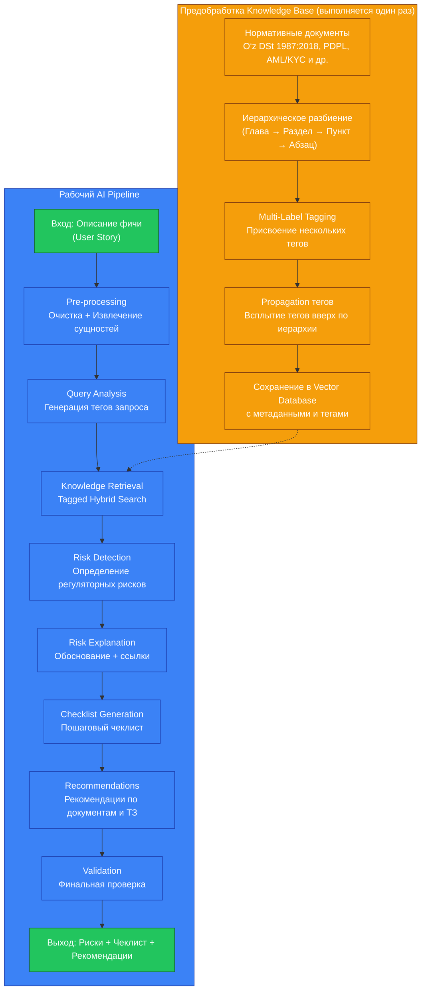

# Техническое Задание: AI-часть проекта

**Финтех-регуляторный радар**

## 1. Цель AI-компонента

Создать высокоточную, объяснимую и быструю AI-систему, способную по описанию продуктовой фичи определять регуляторные риски и формировать практические рекомендации.

## 2. Основные требования к AI

- Время полного ответа: **≤ 6 секунд** (цель — 3–4 секунды)
- Высокая точность определения **неочевидных рисков**
- Объяснимость каждого решения (почему именно этот риск)
- Использование официальных узбекских нормативных документов
- Structured Output (чёткий JSON)

## 3. Knowledge Base (База знаний)

### 3.1. Источники

- O‘z DSt 1987:2018 — «Техническое задание на создание информационной системы»
- Закон Республики Узбекистан «О персональных данных» (PDPL)
- Нормативные документы ЦБ Узбекистана (AML/KYC, платежи)
- Дополнительно: требования MyID, международные аналоги (FATF и др.)

### 3.2. Обработка документов

- **Hierarchical Chunking** — иерархическое разбиение:
    - Уровень 1: Глава
    - Уровень 2: Раздел
    - Уровень 3: Подраздел
    - Уровень 4: Пункт / Абзац (leaf chunk)
- **Multi-Label Tagging** — каждый чанк получает несколько тегов
- **Tag Propagation** — теги дочерних чанков всплывают к родительским (с уменьшенным весом)
- Сохранение метаданных: tags, level, source, relevance_score, chunk_path

### 3.3. Теги (примеры)

**Регуляторные:**

- data_privacy_pdpl, consent_management, transborder_data, kyc_aml, fraud_prevention, crypto_assets, ai_decision, consumer_protection

**Процессные (из O‘z DSt 1987):**

- tz_structure, security_requirements, reliability, documentation, acceptance_testing, integration_requirements, user_requirements

## 4. AI Pipeline (основной процесс)

### Подробное описание каждого этапа:

### Этап 1. Pre-processing + Entity Extraction

- Очистка текста
- Извлечение ключевых сущностей (персональные данные, биометрия, платежи, криптовалюта, AI-модель, трансграничная передача и т.д.)

### Этап 2. Query Tag Generation

- Генерация списка релевантных тегов для текущего запроса

### Этап 3. Tagged Hybrid Retrieval

- Фильтрация по тегам + векторный поиск
- Добавление контекста из родительских чанков
- Возврат топ-N наиболее релевантных чанков

### Этап 4. Risk Detection Agent

**Задача:** Определить список затронутых регуляторных зон + уровень риска.

**Выход:**

- zone, severity (Critical/High/Medium/Low), reason, confidence

### Этап 5. Risk Enrichment

- Добавление обоснования
- Привязка к конкретным пунктам нормативных документов

### Этап 6. Checklist Generator

Генерация конкретного, actionable чеклиста для Product Owner и Compliance.

### Этап 7. Recommendations Generator

- Список документов и политик для обновления
- Рекомендуемые разделы ТЗ по O‘z DSt 1987:2018
- Дополнительные меры (согласия, аудиты, тестирование и т.д.)

### Этап 8. Final Validator

- Self-critique: проверка полноты, логичности и отсутствия галлюцинаций

## 5. Технологии AI-части

- **Orchestration**: LangGraph (LangChain)
- **LLM**: Claude 3.5 Sonnet (основная) + fallback (Grok / GPT-4o)
- **Embeddings**: intfloat/multilingual-e5-large или paraphrase-multilingual-mpnet-base-v2
- **Vector DB**: ChromaDB (для хакатона) / Qdrant
- **Structured Output**: Pydantic v2 + JSON mode / Tool Calling